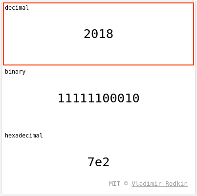

# number-converter

[![Commitizen friendly][commitizen-image]][commitizen-url]
[![XO code style][codestyle-image]][codestyle-url]

[![Build Status][travis-image]][travis-url]
[![Coveralls Status][coveralls-image]][coveralls-url]
[![Dependency Status][depstat-image]][depstat-url]
[![DevDependency Status][depstat-dev-image]][depstat-dev-url]

> %DESCRIPTION%

Demo: [vovanr.github.io/number-converter][demo]

## License
MIT © [Vladimir Rodkin](https://github.com/VovanR)

[demo]: https://vovanr.github.io/number-converter

[commitizen-url]: https://commitizen.github.io/cz-cli/
[commitizen-image]: https://img.shields.io/badge/commitizen-friendly-brightgreen.svg?style=flat-square

[codestyle-url]: https://github.com/sindresorhus/xo
[codestyle-image]: https://img.shields.io/badge/code_style-XO-5ed9c7.svg?style=flat-square

[travis-url]: https://travis-ci.org/VovanR/number-converter
[travis-image]: https://img.shields.io/travis/VovanR/number-converter.svg?style=flat-square

[coveralls-url]: https://coveralls.io/r/VovanR/number-converter
[coveralls-image]: https://img.shields.io/coveralls/VovanR/number-converter.svg?style=flat-square

[depstat-url]: https://david-dm.org/VovanR/number-converter
[depstat-image]: https://david-dm.org/VovanR/number-converter.svg?style=flat-square

[depstat-dev-url]: https://david-dm.org/VovanR/number-converter
[depstat-dev-image]: https://david-dm.org/VovanR/number-converter/dev-status.svg?style=flat-square
